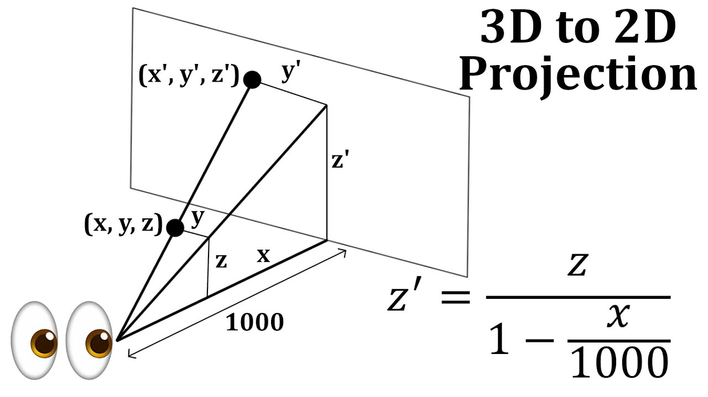

```typescript
type Vertex3D = { x: number; y: number; z: number }
type Vertex2D = { x: number; y: number }

function project({ x, y, z }: Vertex3D): Vertex2D {
	return { x: x / z, y: y / z }
}
```

> 3D vertex - (x, y, z)  
> 2D projection of 3D vertex - (x', y')  
> where x' = x/z and y' = y/z


